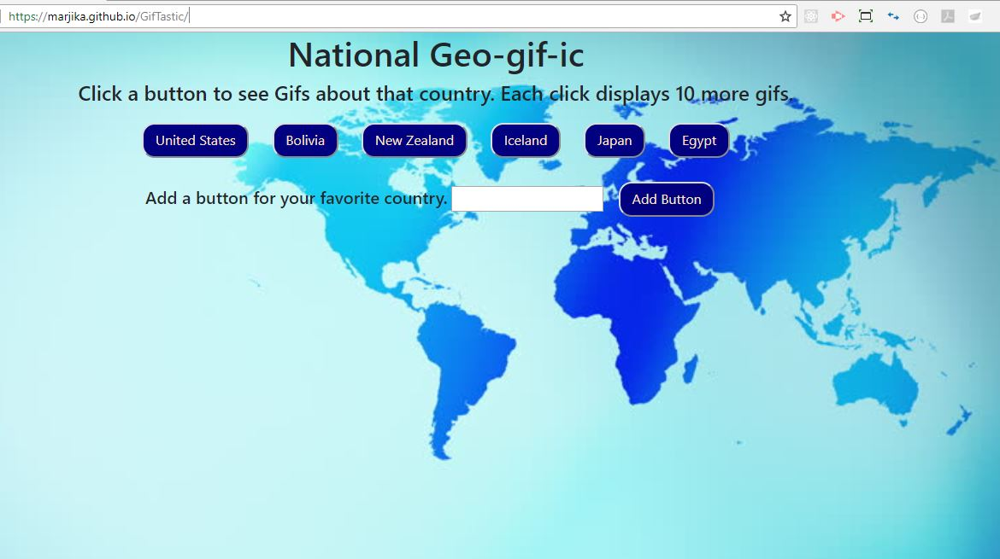
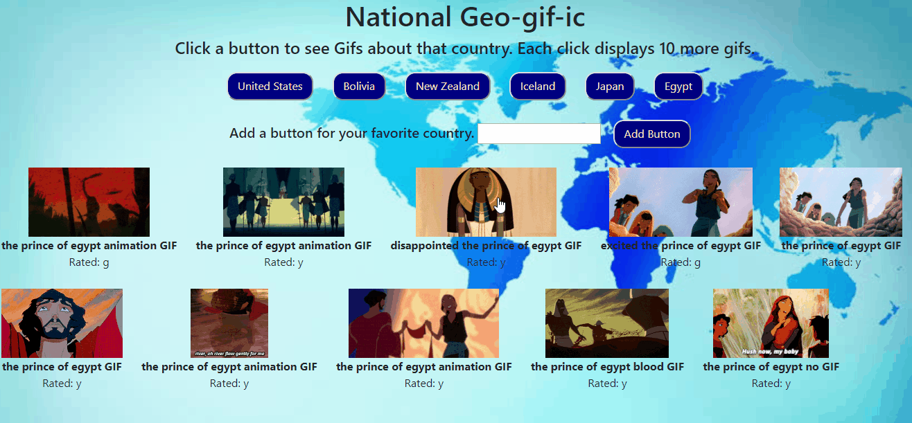

# GifTastic

This repository is for a Javascript application, a Gif search page with a geography theme, using Jquery, API calls, JSON data handling, dynamic buttons and other dynamic HTML elements. The game contains a Javascript file to run the application, an html and css file, and images used.  The styling is created through the use of bootstrap, a css file, and within the html file.  
The application is designed to help the user easily download gifs from the Giphy API.  There are 6 buttons to start, which on a click will download 10 stationary gifs which the user can then click on to see the active state of the gif. 

Each click changes the search offset which gives the user the next 10 gifs in the array so that the user doesn't get the same gifs over and over.  The click displays the title of each gif that is downloaded.  The rating is also displayed, and the application has the additional feature with which the user can create another button which he/she can then click to display their own choice of search word.  The theme for this application is countries of the world, but the user could really input whatever he/she wants when adding a button.

This project is deployed at https://marjika.github.io/GifTastic/ and was created and is maintained by me, Marjika Howarth.